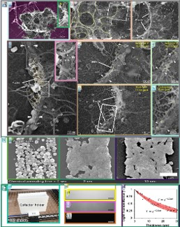
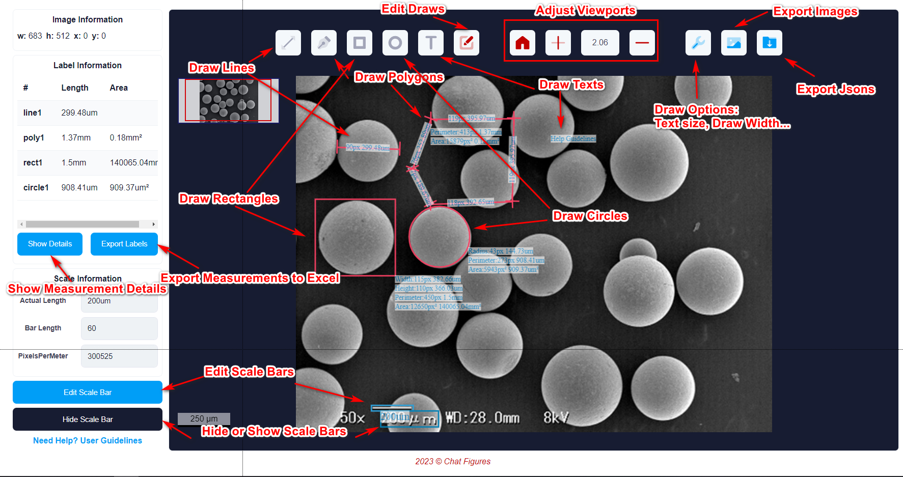

<div align="center">
    <a align="center" href="https://www.chatfigures.com" target="_blank">
      
    </a>
</div>

# Introduction
Chat Figures is a full-stack project, which uses the latest deep learning technology to solve the problem of scientific image understanding.

At present, the project mainly includes the following functions:
- **[Compound figure separation](https://www.chatfigures.com/figure-separation/)** - Separating the compound figure into multiple sub-figures and 
extracting the corresponding labels
- **[Interactive Measurement](https://www.chatfigures.com/interactive-measurement/)** - Recognizing scale bar and scale label to get real scale info. 
Meanwhile, a fine-tuned SAM model aimed at microscopy images is integrated to system for convenient measurement.

You can try the online demo at [https://www.chatfigures.com](https://www.chatfigures.com).

# Features
Chat Figures utilizes **Django** as the backend framework, and **Vue3** as the front-end framework. The deep learning models are most based on **ultralytics**.

ChatGPT API is also adopted in this project (under development).

# Dataset
For the compound figure dataset, please refer to [compound figure dataset](./datasets/compound_figure/readme.md)

For the scalebar dataset, please refer to [scale info dataset](./datasets/scalebar/readme.md)

# Requirements
- Python 3.7+
- PyTorch 1.6+
- CUDA 9.2+
- nodejs 12.0+
- npm 6.0+
- mysql 5.7+ (optional)
- redis 5.0+ (optional)
- docker 19.03+ (optional)
- docker-compose 1.25+ (optional)

# Installation
For the convenience of users, we provide two ways to install the project, including the docker way and the manual way.
First, you need to clone the project to your local environment.
```bash
git clone https://github.com/breeeak/chatfigures.git
cd chatfigures
```

## Docker(Recommended)
We provide a docker-compose file to build the project. Ensure that your docker version >=19.03.
```bash
docker-compose up -d
```
## Manual
The project is mainly divided into four parts: algorithm environment, backend, frontend and Chrome extension.

You can follow the instructions below to install in your own environment. (Note: The following instructions are successful on Ubuntu 18.04.5 LTS)
### Algorithm Environment

The project mainly based on [pytroch](https://pytorch.org/) and [ultralytics](https://ultralytics.com/yolov8). You can refer to the official instructions. 

Below is a simple example of installing the environment using conda.

```bash
# Download and install Miniconda from the official website.
# Create a conda environment and activate it.
conda create --name chatfigures python=3.8 -y
conda activate chatfigures
# Install PyTorch following official instructions eg.
conda install pytorch torchvision -c pytorch
# Install mmegnie mmcv mmdet mmocr mmyolo if you want to use two-stage model.
#pip install openmim \
#    && mim install "mmengine>=0.6.0" \
#    && mim install "mmcv>=2.0.0rc4,<2.1.0" \
#    && mim install "mmdet>=3.0.0rc6,<3.1.0" \
#    && mim install "mmocr>=1.0.0rc0" \
#    && mim install "mmyolo"
cd /cf-backend/apps/figures/recognizers/ultralytics
RUN pip install -e .

```
### Backend
The front-end project is mainly based on Django4 + djangorestframework.
```bash
cd cf-backend
# Install Dependencies
pip install -r requirements.txt
# Migrate Database  If you use mysql, you need to modify the database configuration in the settings.py file. 
python manage.py makemigrations \
    && python manage.py migrate \
    && python manage.py init_db 
# Run Backend Server
python manage.py runserver
```

### Frontend

The front-end project is mainly based on Vue3.0 + Vite + TypeScript + Bootstrap.

You can use the following commands to run the project. Ensure that your nodejs version >=12.0 and npm version >=6.0.
```bash
cd cf-frontend
# Install Dependencies
npm install
# Compile and Hot-Reload for Development
npm run dev
# Type-Check, Compile and Minify for Production
npm run build
```
Then you can visit the project at [http://localhost:8080](http://localhost:8080).

### Chrome extension
navigate to `chrome://extensions/` and enable `developer` mode. Then click the `Load unpacked` button and select the `chrome_extension` folder.


# Getting Started
You can also refer to the help page on the official website [https://www.chatfigures.com](https://www.chatfigures.com) to learn how to use the project.

We also provide a simple and easy-to-use Restful API interface, which can be used for scientific image understanding in various scenarios.
## API
You can upload an image in base64 format to do the compound figure separation and interactive measurement.

**Request Url**


| Type                              | Value                                                        |
|-----------------------------------| ------------------------------------------------------------ |
| Method                            | Post                                                         |
| Url for compund figure separation | https://www.chatfigures.com/api/figures/figureSeparationUpload/ |
| Url for Interactive measurement   | https://www.chatfigures.com/api/figures/figureSeparationUpload/ |

**Request Parameters**

| Name       | is_required | Type   | Description           |
| ---------- | ----------- | ------ | --------------------- |
| filename   | true        | string | the name of the image |
| base64data | true        | string | base64 encoded image  |

**Response Format**

| Name        | Type   | Description                                                  |
| ----------- | ------ | ------------------------------------------------------------ |
| code        | int    | status code  200 for success                                 |
| taskId      | int    | the taskId                                                   |
| jsonDict    | json   | the detection results                                        |
| redirectUrl | string | you can view the results with this url                       |
| token       | string | you need to request with this token as head (Authorization) for "redirectUrl" |

## Visualization






# Citation
The relevant paper is under review. You can also refer to this project.

# Contact
At present, this project is almost maintained by myself and Copilot :laughing: . I know this project is just like a shit, and there are many places that need to be improved.

If you have any questions, please contact me by email: [s.mengjiangnan@gamil.com](mailto:s.mengjiangnan@gamil.com)

# License
This project is released under the [Apache 2.0 license](.github/LICENSE).


