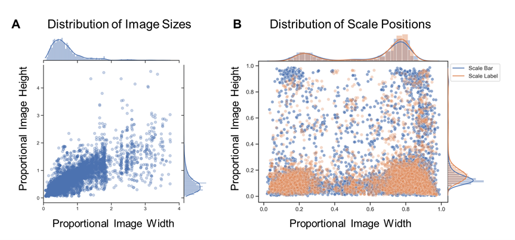
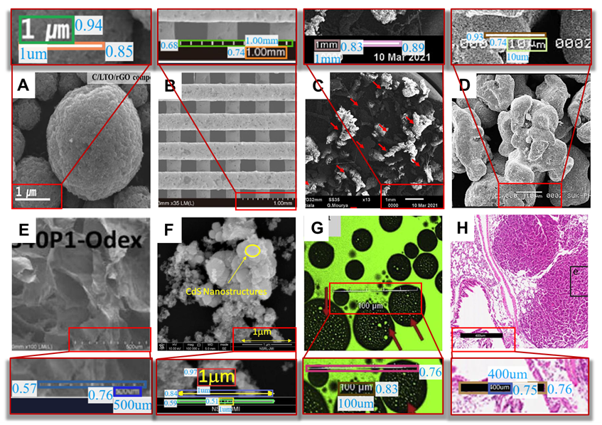

# The largest scalebar dataset !


### Introduction


We established a large scalebar dataset, which contains **14,000** real scientific images including 
bounding boxes and text annotations of scale bars and scale labels. Images came from two parts: 
one is from the EMPS dataset [1], which consists 465 EM particle images. 
The other is mined from the published scientific articles using the data-mining application 
of Elsevier with the keywords “Microscopy”. Many of the mined images are compound images, 
so, we separated them to subfigures and preserved those with scale information.
As far as we know, this is the scalebar dataset. 

### Dataset statistics


A) The distribution of image sizes in our scalebar dataset. The proportional image width/height of the coordinates here is obtained by dividing the width/height of the image by 640/640. 

B) The distribution of scale bar and scale label positions in our scalebar dataset. Each point is represented by a ratio of the position of the object center in the image.


### Label Example




``` json
{
  "name": "37.jpg",
  "meta": {
    "open_access": true,
    "article_url": "https://api.elsevier.com/content/object/pii/S2590123022003310?view=META",
    "img_url": "https://api.elsevier.com/content/object/eid/1-s2.0-S2590123022003310-gr9_lrg.jpg?httpAccept=%2A%2F%2A",
    "title": "Additive manufacturing in the biomedical field-recent research developments",
    "identifier": "DOI:10.1016/j.rineng.2022.100661",
    "source": "ScienceDirectTDM"
  },
  "width": 612,
  "height": 460,
  "bars": [
    {
      "id": 56,
      "points": [
        [
          31.58934027478176,
          428.69509066975934
        ],
        [
          129.1130036716488,
          443.32364017928944
        ]
      ]
    }
  ],
  "labels": [
    {
      "id": 57,
      "points": [
        [
          38.5169677734375,
          401.4017333984375
        ],
        [
          113.11328125,
          426.8883056640625
        ]
      ],
      "text": "2mm"
    }
  ]
}

```

### References

[1]  B. Yildirim and J. M. Cole, "Bayesian particle instance segmentation for electron microscopy image quantification," Journal of Chemical Information and Modeling, vol. 61, no. 3, pp. 1136-1149, 2021.

### Download

dataset download link: https://www.kaggle.com/datasets/original1/scalebar-dataset

If you have any question, please email to s.mengjiangnan@gamil.com


